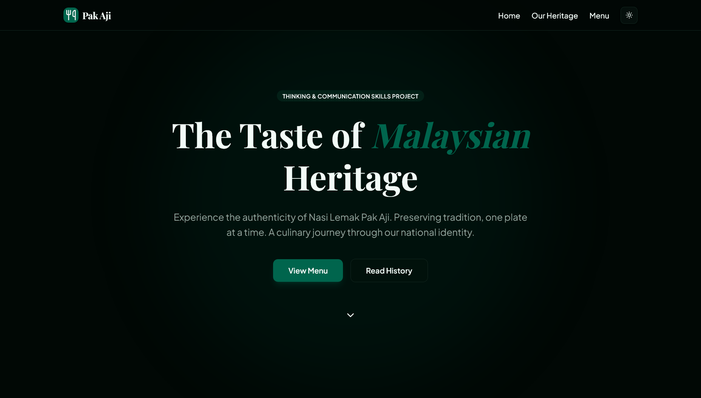

# 🍛 Nasi Lemak Pak Aji

[](https://nextjs.org/)
[](https://reactjs.org/)
[](https://www.typescriptlang.org/)
[](https://tailwindcss.com/)
[](LICENSE)

> Experience the authenticity of Nasi Lemak Pak Aji. Preserving tradition, one plate at a time. A culinary journey through our national identity.



## ✨ Features

### 🎯 Core Features

- **Dynamic Menu System** - Browse through authentic Malaysian dishes with detailed descriptions and pricing
- **QR Code Generation** - Generate and download QR codes for easy menu sharing
- **Social Sharing** - Share menu items via Web Share API with fallback to clipboard
- **Dark/Light Mode** - Seamless theme switching with system preference detection
- **Responsive Design** - Fully optimized for mobile, tablet, and desktop devices

### 🚀 Technical Features

- **SEO Optimized** - Dynamic meta tags, Open Graph, Twitter Cards, and structured data
- **Server-Side Rendering** - Pre-rendered pages for optimal performance and SEO
- **Static Site Generation** - Fast page loads with incremental static regeneration
- **Dynamic Sitemap** - Auto-generated sitemap for all menu items
- **Accessibility** - WCAG compliant with ARIA labels and semantic HTML
- **Error Handling** - Custom 404 and error pages with helpful navigation
- **Loading States** - Skeleton screens for better perceived performance
- **PWA Ready** - Web app manifest for installable experience

## 🛠️ Tech Stack

- **Framework:** Next.js 16.0.4 (App Router)
- **Language:** TypeScript 5
- **Styling:** Tailwind CSS 4
- **UI Components:** Radix UI primitives
- **Icons:** Lucide React
- **QR Codes:** react-qr-code
- **Theme Management:** next-themes
- **Fonts:** Google Fonts (Playfair Display, Plus Jakarta Sans)

## 📦 Installation

### Prerequisites

- Node.js 18.x or higher
- npm, yarn, or pnpm

### Setup

1. **Clone the repository**

```bash
git clone https://github.com/yourusername/nasi-lemak-pak-aji.git
cd nasi-lemak-pak-aji
```

2. **Install dependencies**

```bash
npm install
# or
yarn install
# or
pnpm install
```

3. **Configure environment variables** (optional)

```bash
cp .env.example .env.local
```

Edit `.env.local` with your configuration:

```env
NEXT_PUBLIC_SITE_URL=https://your-domain.com
NEXT_PUBLIC_GA_ID=your-google-analytics-id
```

4. **Run the development server**

```bash
npm run dev
```

Open [http://localhost:3000](http://localhost:3000) in your browser.

## 🎨 Project Structure

```
nasi-lemak-pak-aji/
├── public/                      # Static assets
│   ├── images/                  # Menu item images
│   ├── favicon.ico              # Favicon
│   ├── site.webmanifest         # PWA manifest
│   └── og-image.jpg             # Open Graph image
├── src/
│   ├── app/                     # Next.js App Router
│   │   ├── layout.tsx           # Root layout with metadata
│   │   ├── page.tsx             # Homepage
│   │   ├── not-found.tsx        # 404 page
│   │   ├── sitemap.ts           # Dynamic sitemap
│   │   ├── robots.ts            # Robots.txt configuration
│   │   └── menu-item/[id]/      # Dynamic menu pages
│   │       ├── page.tsx         # Menu item page
│   │       ├── loading.tsx      # Loading skeleton
│   │       └── error.tsx        # Error boundary
│   ├── components/              # React components
│   │   ├── navigation/          # Navbar component
│   │   ├── menu/                # Menu display components
│   │   ├── hero/                # Hero section
│   │   ├── heritage/            # Heritage section
│   │   ├── footer/              # Footer component
│   │   ├── share/               # Share & QR components
│   │   ├── ui/                  # Reusable UI components
│   │   └── providers/           # Context providers
│   ├── data/                    # Static data
│   │   ├── menu-items.ts        # Menu items data
│   │   └── nav-items.ts         # Navigation items
│   ├── hooks/                   # Custom React hooks
│   │   └── use-share.ts         # Share functionality hook
│   └── lib/                     # Utility functions
│       └── utils.ts             # Helper utilities
├── .env.example                 # Environment variables template
├── next.config.ts               # Next.js configuration
├── tailwind.config.ts           # Tailwind CSS configuration
├── tsconfig.json                # TypeScript configuration
└── package.json                 # Dependencies
```

## 🎯 Key Components

### Menu Item Page (`src/app/menu-item/[id]/page.tsx`)

- Dynamic routing for individual menu items
- SEO metadata generation with Open Graph and Twitter Cards
- Structured data (JSON-LD) for rich search results
- QR code generation and sharing functionality
- Responsive image gallery with Next.js Image optimization

### Share Hook (`src/hooks/use-share.ts`)

- Reusable sharing functionality
- Web Share API integration with clipboard fallback
- Support for sharing URLs, text, and files

### Navigation (`src/components/navigation/navbar.tsx`)

- Fixed header with backdrop blur
- Dark/light mode toggle
- Smooth anchor navigation
- Accessible ARIA labels

## 🌐 SEO Configuration

The application includes comprehensive SEO optimization:

- **Meta Tags:** Dynamic title, description, keywords per page
- **Open Graph:** Full OG image and metadata support
- **Twitter Cards:** Large image cards for social sharing
- **Structured Data:** Schema.org MenuItem and Restaurant markup
- **Sitemap:** Auto-generated XML sitemap at `/sitemap.xml`
- **Robots.txt:** Configured at `/robots.txt`
- **Canonical URLs:** Proper URL canonicalization

## 📱 PWA Configuration

The site is PWA-ready with:

- Web app manifest (`site.webmanifest`)
- App icons (192x192, 512x512)
- Apple touch icons
- Theme color configuration

## 🚀 Deployment

### Deploy to Vercel (Recommended)

[](https://vercel.com/new/clone?repository-url=https://github.com/yourusername/nasi-lemak-pak-aji)

1. Push your code to GitHub
2. Import project to Vercel
3. Configure environment variables (if any)
4. Deploy!

### Manual Deployment

```bash
# Build for production
npm run build

# Start production server
npm run start
```

### Environment Variables

Create `.env.local` for local development:

```env
NEXT_PUBLIC_SITE_URL=http://localhost:3000
NEXT_PUBLIC_GA_ID=G-XXXXXXXXXX
```

For production, update `NEXT_PUBLIC_SITE_URL` to your actual domain.

## 🎨 Customization

### Adding Menu Items

Edit `src/data/menu-items.ts`:

```typescript
{
  id: 5,
  name: "Your Dish Name",
  price: "RM 15.00",
  description: "Detailed description...",
  image: "/images/your-dish.jpg",
  tag: "Popular",
  history: "Historical context...",
  sub_menu: [
    { name: "Extra", price: "RM 2.00" }
  ]
}
```

### Updating Site URL

Update the base URL in:

- `src/app/layout.tsx` - metadataBase
- `src/app/sitemap.ts` - baseUrl
- `src/app/robots.ts` - sitemap URL
- `.env.local` - NEXT_PUBLIC_SITE_URL

### Adding Icons

Place icons in `/public`:

- `favicon.ico` (32x32)
- `favicon-16x16.png`
- `favicon-32x32.png`
- `apple-touch-icon.png` (180x180)
- `android-chrome-192x192.png`
- `android-chrome-512x512.png`

## 🧪 Scripts

```bash
# Development
npm run dev          # Start dev server

# Production
npm run build        # Build for production
npm run start        # Start production server

# Code Quality
npm run lint         # Run ESLint
```

## 🤝 Contributing

Contributions are welcome! Please follow these steps:

1. Fork the repository
2. Create a feature branch (`git checkout -b feature/amazing-feature`)
3. Commit your changes (`git commit -m 'Add amazing feature'`)
4. Push to the branch (`git push origin feature/amazing-feature`)
5. Open a Pull Request

## 📄 License

This project is licensed under the MIT License - see the [LICENSE](LICENSE) file for details.

## 🙏 Acknowledgments

- Menu images from [Unsplash](https://unsplash.com)
- UI components powered by [Radix UI](https://radix-ui.com)
- Icons from [Lucide](https://lucide.dev)
- Deployed on [Vercel](https://vercel.com)

## 📞 Contact

- **Website:** [nasi-lemak-pak-aji.vercel.app](https://nasi-lemak-pak-aji.vercel.app)
- **Email:** raiyan.takrim3@gmail.com
- **GitHub:** [@raiyan-takrim](https://github.com/raiyan-takrim)

---

Made with ❤️ by [RAIYAN TAKRIM](https://github.com/yourusername)

Preserving Malaysian culinary heritage, one plate at a time. 🇲🇾
